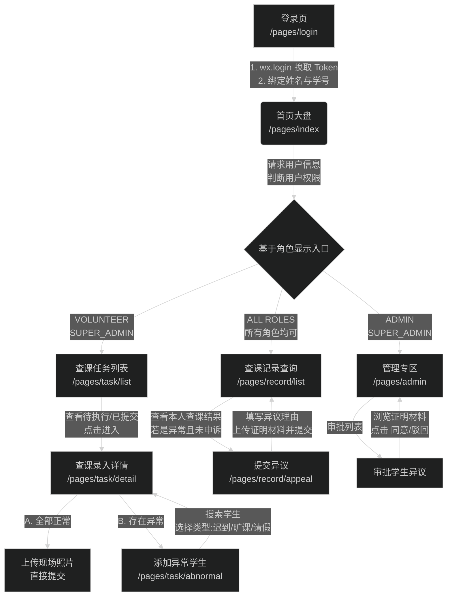

# Build

cd miniprogram -> npm install -> 微信开发者工具 -> 工具 -> 构建 npm

# 查课管理系统 - 小程序端应用逻辑

本文档概述了目前微信小程序端“查课管理系统”的核心业务逻辑、角色权限以及页面流转机制。

## 1. 核心流程架构图

以下是小程序端核心业务流转的 Mermaid 流程图：

---

## 2. 角色与入口设计

当前系统从 `/api/v1/user/info` 中获取 `role` 字段来决定功能可见性：

- **STUDENT（普通学生）**：
  - 仅能看到“查课记录”。
  - 核心诉求：查询自己的出勤状态，在被误判（如请假却被记旷课）时提交异议材料。
- **VOLUNTEER（志愿者）**：
  - 拥有普通学生功能 + “查课任务”。
  - 核心诉求：执行系统分配的实地查课任务，录入考勤结果和现场照片。
- **ADMIN（管理员 / 老师）**：
  - 拥有普通学生功能 + “管理专区”。
  - 核心诉求：处理学生提交的考勤异议（同意或驳回）。
- **SUPER_ADMIN（超级管理员）**：
  - 拥有小程序端所有功能（上述全部）。

---

## 3. 核心功能模块详细逻辑

### 3.1 鉴权与绑定模块 (`/pages/login/index`)
- **逻辑**：静默调用 `wx.login` 获取微信 `code` 并向后端换取鉴权 `Token`。
- **绑定**：强制用户输入姓名与学号，将微信号、学号以及身份权限绑定。

### 3.2 志愿者查课模块 (`/pages/task/*`)
- **列表 (`list`)**：分“待执行(TODO)”与“已提交(DONE)”双 Tab，展示时间、周次、课程、教室、班级信息。
- **详情 (`detail`)**：展示任务元数据。核心是通过单选框控制两套业务流：
  - **全部正常**：直接要求（或选填）拍摄现场照片，提交结果。
  - **存在异常**：触发异常录入逻辑。
- **异常录入 (`abnormal`)**：
  - 支持按姓名/学号模糊搜索班级学生。
  - 用户可连续将多名学生添加到“已选名单”，并独立为每人设置异常类别（迟到、旷课、请假）。
  - 确认后，数据回传至详情页，与现场照片一并提交。

### 3.3 学生记录与异议模块 (`/pages/record/*`)
- **列表 (`list`)**：展示该学生的所有历史考勤。若状态不是“正常”且尚未发起异议，提供“提出异议”操作按钮。
- **异议提交 (`appeal`)**：表单页面，要求必须输入异议理由（如“已提前在导员处请假”），并支持上传最多 3 张相关截图证明，提交后记录状态变更为“异议处理中”。

### 3.4 管理员审批模块 (`/pages/admin/index`)
- **审批列表 (`Tab 0`)**：
  - 加载所有待处理的异议请求。
  - 采用卡片流展示申请人的学号、姓名、原判状态和异议理由。
  - 管理员可直接点击缩略图调用 `wx.previewImage` 预览大图证明材料。
  - 操作区域提供快捷的“同意”与“驳回”动作，完成后局部刷新列表。
- **排班管理 (`Tab 1`)**：当前由于小程序端交互空间有限，引导管理员前往未来的 Web 平台端进行更复杂的排班增删改查。
