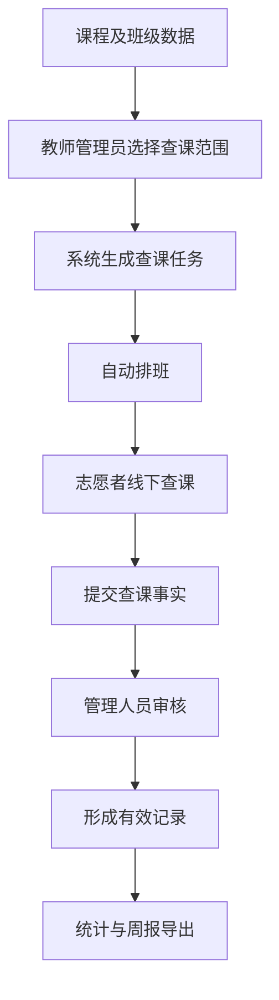
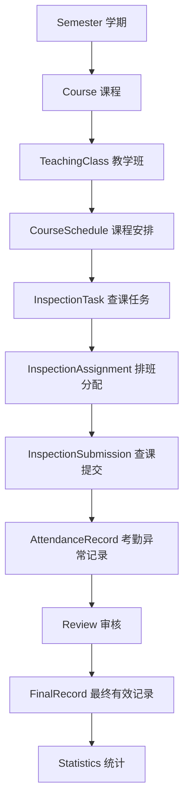
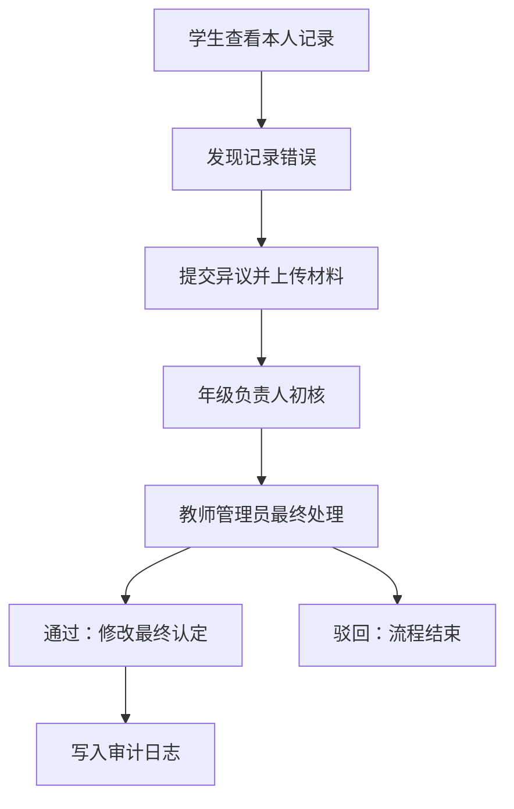
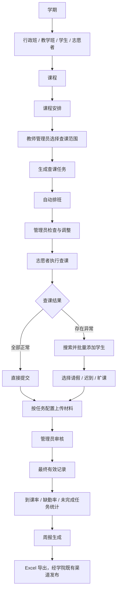

# 查课管理系统 V1.0 建设说明

| 项目 | 内容 |
|------|------|
| 产品名称 | 查课管理系统 |
| 文档版本 | V1.0 |
| 产品形态 | 微信小程序（志愿者端、学生端）+ Web 管理后台 |
| 目标用户 | 教师管理员、年级负责人、查课志愿者、普通学生 |
| 建设范围 | 学院查课排班、查课记录、审核、统计、异议处理与周报导出 |
| 核心原则 | 少状态、少角色、少流程；事实独立记录；关键操作可追溯；权限严格隔离 |

## 一、产品定位与建设范围

### 1.1 产品定位

> 学院线下查课工作的排班、录入、审核、统计和留痕平台。

系统的核心业务主线：



各环节职责划分：

| 环节 | 责任方 |
|------|--------|
| 课程安排提供"什么时候有什么课" | 基础数据 |
| 决定哪些课程和班级需要查 | 教师管理员 |
| 决定由谁去查 | 自动排班 + 管理员调整 |
| 提交现场事实 | 志愿者 |
| 审核与认定 | 管理人员 |
| 纠正错误记录 | 学生异议机制 |
| 计算到课率和缺勤率 | 统计层 |
| 统计汇总与导出 | 周报模块 |

### 1.2 V1.0 建设范围总览

| 功能域 | 建设内容 |
|--------|----------|
| 基础数据 | 学期管理、行政班管理、教学班管理、课程管理、课程安排管理、学生数据管理、志愿者管理 |
| 任务与排班 | 查课任务生成、自动排班、人工调整排班、任务取消 |
| 查课执行 | 志愿者查课录入、异常学生批量录入、纸质材料照片上传 |
| 审核与认定 | 查课记录审核、应到人数管理 |
| 统计输出 | 到课率统计、缺勤率统计、未完成任务统计、周报生成与导出 |
| 学生服务 | 学生本人记录查询、证明材料上传、异议提交 |
| 异议处理 | 年级负责人初核、教师管理员最终处理 |
| 平台支撑 | 审计日志、基于角色和数据范围的权限控制 |

### 1.3 设计原则

1. **事实与统计分离**：录入层只记录原始事实（应到人数、请假人数、迟到人数、旷课人数），所有比例与折算规则统一在统计层应用。
2. **周报定位为统计输出**：周报基于当前有效数据生成，可重复生成；导出后数据保持可更正状态，学生仍可提交异议，管理人员仍可复核更正。
3. **审计与业务动作绑定**：只要发生重要业务动作即写入审计日志，与周报生成、导出、公示时间无关。
4. **状态最少**：任务状态仅保留四种，可从已有数据推导的状态由数据推导。
5. **安全依靠权限和审计**：通过后端权限校验、数据范围控制、附件私有访问、关键修改审计、身份唯一 ID、历史数据快照保障安全。

## 二、角色与权限设置

### 2.1 权限模型

系统权限由三个要素共同决定：

```text
角色 Role + 功能权限 Permission + 数据范围 DataScope
```

系统设置五类固定角色：超级管理员、教师管理员、年级负责人、志愿者、普通学生。

### 2.2 角色权限矩阵

| 功能 | 超级管理员 | 教师管理员 | 年级负责人 | 志愿者 | 普通学生 |
|------|:---:|:---:|:---:|:---:|:---:|
| 用户与角色管理 | 全部 | 配置年级负责人 | — | — | — |
| 学期与基础数据管理 | 全部 | 是 | — | — | — |
| 查课范围选择与任务生成 | 全部 | 是 | — | — | — |
| 自动排班与人工调整 | 全部 | 是 | — | — | — |
| 任务取消 | 全部 | 是 | — | — | — |
| 排班查看 | 全部 | 全部 | 本年级 | 仅本人 | — |
| 查课结果提交与照片上传 | — | — | — | 仅本人任务 | — |
| 排班调整申请 | — | — | — | 是 | — |
| 查课记录审核 | 全部 | 是 | — | — | — |
| 应到人数人工调整 | 全部 | 是 | — | — | — |
| 考勤记录查看 | 全部 | 全部 | 本年级 | — | 仅本人 |
| 异议初核 | 全部 | 是 | 授权后可 | — | — |
| 异议最终处理 | 全部 | 是 | — | — | — |
| 异议提交与证明材料上传 | — | — | — | — | 是 |
| 班级 / 课程统计 | 全部 | 是 | 本年级（授权） | — | — |
| 未完成任务统计 | 全部 | 是 | 本年级（授权） | — | — |
| 周报生成与导出 | 全部 | 是 | 查看（授权） | — | — |
| 审计日志查看 | 全部 | — | — | — | — |
| 系统配置 | 全部 | — | — | — | — |

### 2.3 数据范围控制

年级负责人通过授权数据范围限定访问边界，例如：

```text
role = Grade Manager
scope = 2025级
```

年级负责人可被授权的功能（是否开通由教师管理员配置）：查看本年级查课任务、未完成任务、考勤记录、学生名单、统计数据，以及异议初核。其数据范围限定在授权年级内，手工构造 API 也只能获取授权年级数据。

### 2.4 权限校验要求

1. **后端强制校验**：所有敏感 API 在后端校验当前用户角色、功能权限、数据范围、资源归属四要素，前端界面控制仅作为展示辅助。
2. **附件访问控制**：请假证明、查课纸质照片、异议证明材料的访问必须经过身份认证和权限检查，或使用短时有效访问链接。
3. **身份关联**：学生统一通过 `student_id` 建立业务关联，姓名仅作为搜索字段和显示字段。

## 三、基础数据设置

### 3.1 核心数据实体

| 实体 | 关键字段 | 说明 |
|------|----------|------|
| 学期 Semester | semester_id、semester_name、start_date、end_date、status | 全部核心业务数据必须归属某个学期，如 2026-FALL、2027-SPRING |
| 行政班 Administrative Class | 班级 ID、名称 | 学生所属行政管理班级，用于学生归属、年级数据范围、本班回避、班级统计 |
| 教学班 Teaching Class | 教学班 ID、学生集合 | 实际一起参加某门课程教学的学生集合，可对应一个行政班、多个行政班或部分跨班学生 |
| 课程 Course | course_id、course_name | 课程本身，如高等数学、数据结构 |
| 课程安排 Course Schedule | semester_id、course_id、teaching_class_id、weekday、period、classroom | 某学期实际发生的周期性教学安排 |
| 学生 Student | student_id、student_no、name、administrative_class_id、grade、status | 内部所有关系通过 student_id 建立 |
| 志愿者 Volunteer | 用户账号、student_id、行政班、可参与查课状态 | 属于系统用户，额外关联学号、行政班与查课资格 |

### 3.2 核心数据关系



辅助关系：

```text
行政班 → 学生（组织归属）
用户 → 角色 → 功能权限 → 数据范围（权限链）
考勤记录 → 异议 → 初核 → 终审 → 更正 → 审计日志（异议链）
```

### 3.3 历史数据快照

基础数据变化时，已发生的历史业务事实保持原值。查课任务在生成或执行时保存必要快照：

- 当时课程、班级、日期、节次、教室
- 应到人数（如 expected_count_snapshot = 40）

学生转专业等名单变动只影响后续任务，历史任务统计保持稳定。

### 3.4 系统配置项

V1.0 提供四项配置：

| 配置项 | 说明 |
|--------|------|
| 当前学期 | 全局生效的学期 |
| 查课单元照片要求 | 按查课单元配置是否必须上传照片（require_photo = true / false） |
| 年级负责人权限 | 各功能开关 |
| 年级负责人数据范围 | 授权年级 |

## 四、功能模块实现方式

### 4.1 查课任务生成

教师管理员根据课程安排主动选择需要检查的范围，系统据此生成查课任务。生成流程：

```text
选择周次 / 日期 → 选择需要查课的班级或课程 → 系统生成查课任务 → 进入自动排班
```

查课任务至少包含：学期、周次、日期、节次、课程、教学班或行政班、查课类型、负责志愿者。早自习、正常课程和晚自习统一抽象为查课任务。

### 4.2 自动排班

自动排班的职责是为已生成的查课任务分配合适志愿者。

**硬约束**（分配必须满足）：

1. 志愿者该时间无本人课程冲突
2. 志愿者与被查班级非同一行政班（本班回避）
3. 同一志愿者同一时间只执行一个任务
4. 志愿者账号有效
5. 志愿者具有当前学期查课资格

**软约束**（尽量满足）：平衡志愿者查课次数，避免少数志愿者承担过多任务。

分配逻辑采用简单、可靠、可解释的规则。

### 4.3 排班人工调整与任务取消

管理员可对自动排班结果直接修改，调整后系统重新校验时间冲突、本班回避、同时多任务冲突。志愿者如需调整，提交调整申请，由管理员决定重新安排。

管理员教师可直接手动取消查课任务：`正常任务 → 管理员取消 → 已取消`。课程调整到新时间且仍需查课时，生成新的查课任务。

### 4.4 查课任务状态

任务状态共四种，由现有数据推导：

| 状态 | 推导条件 |
|------|----------|
| 已取消 | 任务被管理员取消 |
| 待执行 | 无有效提交 |
| 待审核 | 存在提交且未审核 |
| 已完成 | 审核通过 |

### 4.5 志愿者查课录入

志愿者进入本人查课任务后，首先选择本次查课结果：**全部正常** 或 **存在异常学生**。

系统通过提交数据严格区分三种情况：

| 情况 | 数据特征 | 业务含义 |
|------|----------|----------|
| 未提交 | Submission 不存在 | 志愿者尚未完成有效提交 |
| 全部正常 | result = NORMAL，异常记录 0 条 | 已完成查课，未发现异常学生 |
| 存在异常 | result = ABNORMAL，异常记录 > 0 条 | 已完成查课，并发现异常学生 |

异常人数为 0 与未查课是两种不同的业务含义，统计口径分别处理。

### 4.6 异常学生批量录入

选择"存在异常"后进入批量录入，分三步：

**第一步：搜索学生**。志愿者在搜索框输入姓名，系统实时匹配当前查课范围内学生，结果展示姓名、学号、行政班（如"张伟 2024123456 计科2401"），同名学生通过学号和行政班区分。

**第二步：连续选择**。点击搜索结果后学生加入已选列表，搜索框自动清空，可继续输入下一名学生；点击 × 移除误选学生。

**第三步：批量选择异常类型**。完成学生选择后统一为每人选择请假、迟到或旷课。每名学生默认为空，志愿者逐一完成选择后方可提交。

### 4.7 纸质材料照片

纸质材料原件按线下规定保存，系统照片作为电子留档和人工核验依据。是否必须上传照片由管理员按查课单元配置（见 3.4）。

### 4.8 查课记录审核

志愿者提交后进入待审核状态，由教师管理员或被授权人员审核，审核通过后形成当前有效考勤记录。纸质材料与电子记录存在不一致时，由有权限的管理人员人工核实。系统保存原始提交、最终认定、相关证据和修改日志。

### 4.9 应到人数

系统根据当前任务对应的有效学生名单自动计算应到人数，管理员可人工调整。调整记录保存原应到人数、修改后应到人数、操作人、操作时间。历史查课任务使用任务生成或执行时保存的应到人数快照。

### 4.10 统计规则

统计层只读取原始考勤记录，计算口径如下：

```text
有效应到人数 = 应到人数 - 请假人数

缺勤率 = (迟到人数 + 旷课人数) / 有效应到人数

到课率 = 1 - 缺勤率
       = (有效应到人数 - 迟到人数 - 旷课人数) / 有效应到人数
```

边界情况：有效应到人数 ≤ 0 时，本次到课率和缺勤率显示为"无有效统计数据"，避免除零错误。

### 4.11 未完成任务统计

判定规则：

```text
已到达查课时间 + 任务未取消 + 无有效提交 = 未完成任务
```

管理端展示学期、周次、日期、节次、班级、课程、志愿者、当前状态。教师管理员查看全局或授权范围，年级负责人查看授权年级。

### 4.12 学生个人查询

普通学生可查看本人考勤记录的日期、周次、课程、异常类型、当前认定状态和已处理异议结果，数据范围仅限本人。

### 4.13 学生异议

学生发现本人考勤记录有误时可发起异议，上传请假材料、活动证明、相关截图等证明材料（材料作为核验依据）。处理流程：



教师管理员支持一键通过、一键驳回。异议通过并需要修改考勤认定时，原始记录永久保留，以新增方式生成更正并更新最终有效认定。异议流程与周报生成、导出、外部发布时间相互独立。

### 4.14 审计日志

审计日志回答：谁、在什么时候、对哪条重要业务数据、进行了什么修改。

**必须审计的操作**：

| 类别 | 操作 |
|------|------|
| 查课 | 志愿者查课提交、查课审核 |
| 数据 | 应到人数人工修改、最终考勤结果更正 |
| 异议 | 学生提交异议、年级负责人初核、教师管理员最终处理 |
| 权限 | 用户重要权限变更 |

考勤更正日志示例：

```text
record_id: 10086
before:    attendance_type = 旷课
after:     attendance_type = 请假
operator_id: 18
operator_role: ADMIN
related_objection_id: 302
operation_time: 2026-09-20 15:21
```

历史修改逐条追加，可完整回溯。

### 4.15 周报

周报基于某一统计周期内的有效查课记录生成，内容包括统计周期、查课次数、已完成任务数、未完成任务数、班级到课率、班级缺勤率、课程到课率、异常学生明细、请假迟到旷课统计，表格格式对齐学院现有周报模板。

支持 Excel 导出。周报导出后数据保持可更正状态：学生仍可提交异议，管理员仍可复核更正记录。周报通过既有渠道（QQ 群、微信群、钉钉群等）由学院发布；外部已发布周报后发生更正时，是否发布更正版由学院业务管理人员决定。

### 4.16 管理端核心视图

提供查课任务列表或课表式视图：

| 周次 | 日期 | 节次 | 班级 | 课程 | 志愿者 | 状态 | 异常人数 |
|------|------|------|------|------|--------|------|--------:|
| 第4周 | 9/21 | 1-2 | 计科2401 | 高数 | 张三 | 已完成 | 0 |
| 第4周 | 9/21 | 3-4 | 计科2402 | 数据结构 | 李四 | 未完成 | - |
| 第4周 | 9/21 | 5-6 | 计科2403 | 大英 | 王五 | 待审核 | 3 |
| 第4周 | 9/21 | 7-8 | 计科2404 | 体育 | - | 已取消 | - |

其中 0 表示已完成查课且无异常，- 表示无有效异常统计结果。

## 五、数据安全要求

1. **后端权限校验**：所有敏感 API 在后端完成角色、权限、数据范围、资源归属校验。
2. **数据范围隔离**：按授权数据范围隔离访问，越权请求在后端被拒绝。
3. **附件保护**：证明材料与查课照片通过认证访问或短时有效链接获取。
4. **身份唯一性**：业务关联一律使用 student_id，姓名仅用于搜索与展示。
5. **历史保护**：原始记录永久保留，更正以追加方式记录，历史快照防止统计漂移。

## 六、V1.0 验收标准

**基础数据**：能建立学期，导入学生、志愿者、课程与课程安排，正确关联行政班和教学班。

**查课任务**：管理员可选择需要检查的课程或班级；系统生成查课任务并自动分配志愿者；自动排班能识别本人班级冲突和时间冲突；管理员可人工修改、可取消任务。

**志愿者端**：能查看本人任务；能提交"全部正常"；能连续搜索并选择多名异常学生；能为每名学生分别选择请假、迟到或旷课；能按配置上传照片；仅能操作本人负责的任务。

**管理审核**：能审核查课提交；能区分未提交、全勤、存在异常三种情况；能人工修改应到人数；所有重要修改可追溯。

**统计输出**：能统计有效应到人数、缺勤率、到课率；能查看班级统计、课程统计、未完成任务；能生成并导出周报。

**学生端**：仅能查看本人数据；能提交异议、上传证明材料、查看异议处理结果。

**权限**：超级管理员拥有全部权限；教师管理员拥有授权业务权限；年级负责人仅访问授权数据范围；志愿者仅操作本人任务；学生仅访问本人数据；后端能阻止越权 API 请求。

## 七、V1.0 核心业务全流程



建设目标是：任务可确认、记录可核验、异常可纠正、修改可追溯、权限可控制、统计可复现。
